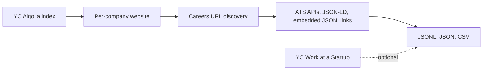

<div align="center">

# JobCrawler

### Open roles across the YC portfolio—scraped from real career pages

*Walk the [Y Combinator company directory](https://www.ycombinator.com/companies), resolve each startup’s careers hub, and collect postings via ATS APIs, structured data, and smart HTML parsing—optionally layered with [Work at a Startup](https://www.ycombinator.com/jobs) listings.*

<br/>

</div>

---
https://github.com/user-attachments/assets/a72df742-14af-4d9b-8854-ddee066820e5

## What it does

1. **Loads the live YC directory** via Algolia (same index the YC website uses), filtered to companies that are hiring—unless you ask for everyone.
2. **Finds each company’s careers URL** from their public site—common paths, nav links, and popular ATS hosts (Greenhouse, Lever, Ashby, and more).
3. **Extracts jobs** using the fastest accurate path first: direct ATS JSON APIs, then embedded page data (`__NEXT_DATA__`-style), **JSON-LD** `JobPosting`, and strict job-link heuristics so culture and policy pages are left out.
4. **Optionally** pulls roles from `ycombinator.com/companies/{slug}/jobs` when you enable Work at a Startup mode.

External careers are **not** skipped just because YC also lists a role—you get both when you want them.

---

## Features

| | |
| :--- | :--- |
| **Multi-format export** | Every run writes **JSON Lines**, a pretty **JSON** array, and a flat **CSV** (unless you stream JSONL to stdout). |
| **Parallel & sharded** | Run `--parallel N` worker processes, or manual `--shards` / `--shard` slices with deterministic slug hashing—then merge CSVs. |
| **JS-heavy sites** | Optional **Playwright** (Chromium) for listings that only appear after JavaScript runs, plus an HTTP-first **fallback** mode. |
| **Polite by default** | Configurable **delay** between companies; built for respectful crawling. |

---

## Requirements

- **Python 3.10+** recommended  
- Dependencies: `httpx`, `beautifulsoup4`, `certifi`, and optionally `playwright` for browser-backed pages  

---

## Installation

```bash
cd JobCrawler
python3 -m venv .venv
source .venv/bin/activate   # Windows: .venv\Scripts\activate
pip install -r requirements.txt
```

### Package name (`scraper`)

Imports and the CLI use the package name **`scraper`**, while this repository keeps sources under `Yc_crawler/`. From the project root, add a symlink so Python can resolve it:

```bash
ln -s Yc_crawler scraper
```

On Windows, create a directory junction or symlink to `Yc_crawler` named `scraper`, or run from a clone where the package folder is already named `scraper`.

Then:

```bash
python3 -m scraper --help
```

### Optional: Playwright (JavaScript-rendered boards)

```bash
pip install -r requirements-browser.txt   # or: pip install playwright
python3 -m playwright install chromium
```

---

## Usage

### Basic scrape (hiring companies only)

```bash
python3 -m scraper -o jobs
```

Produces `jobs.jsonl`, `jobs.json`, and `jobs.csv`.

### Include YC “Work at a Startup” listings

```bash
python3 -m scraper -o jobs --include-yc-jobs
```

### Limit scope (testing)

```bash
python3 -m scraper --max-companies 20 -o sample
```

### All directory companies (not only “hiring”)

```bash
python3 -m scraper --all-companies
```

*Much slower; use when you need coverage beyond the hiring filter.*

### Parallel workers

```bash
python3 -m scraper -o jobs --parallel 4
```

Merges shard CSVs into a single `jobs.csv` when finished (skip with `--no-merge-csv`).

### Manual sharding

```bash
python3 -m scraper -o jobs --shards 4 --shard 0   # terminal 1
python3 -m scraper -o jobs --shards 4 --shard 1   # terminal 2
# …
```

Merge later:

```bash
python3 -m scraper merge -o jobs
```

### Playwright

```bash
python3 -m scraper --playwright
# or: retry with the browser only when HTTP finds nothing
python3 -m scraper --playwright-fallback
```

### Useful flags

| Flag | Purpose |
| :--- | :--- |
| `-o`, `--output` | Base path for exports (default `jobs`). Use `-` for JSONL on stdout only. |
| `--delay` | Seconds between companies (default `0.5`). |
| `--skip-external` | Only use with `--include-yc-jobs`—YC listings only, no website crawl. |
| `--verbose` | Emit records when careers pages exist but no jobs were parsed. |
| `--quiet` | Suppress progress on stderr. |

---

## Output columns (CSV)

The flattened CSV is easy to filter in spreadsheets or SQL. Typical fields include:

`source`, `company_name`, `company_slug`, `batch`, `website`, `job_title`, `location`, `job_url`, `apply_url`, `careers_url`, `salary_range`, `job_type`, `job_source`, plus `stage` / `error` when something fails.

`source` distinguishes **`company_careers`** (your crawl) from **`yc_work_at_startup`** (YC-hosted listings).

---

## How it fits together



---

## Ethics & disclaimer

- This tool is for **personal research and job discovery**. Respect site terms, robots guidance, and rate limits; the default delay is a starting point, not a guarantee of appropriateness for every site.
- **Not affiliated with Y Combinator.** Company data and listings come from public pages; accuracy and availability depend on those sources.
